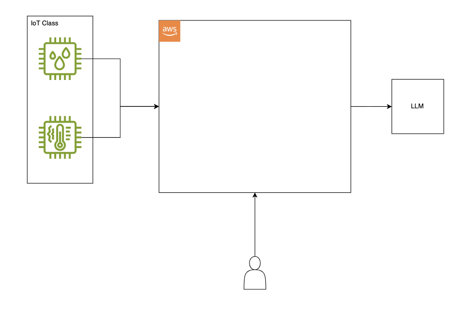

# Final Project: IoT Data Platform with Natural Language Querying

## 1. Overview

In this final project, you will build a cloud-based platform that ingests IoT sensor data and exposes it through two different query interfaces: a deterministic API and a natural language interface powered by a Large Language Model (LLM).

This project brings together concepts from Labs 1 and 2, combining infrastructure, serverless computing, data storage, and API design. You will also integrate with an external LLM service to transform natural language questions into database queries.

**Team Structure:**
- Work in teams of 4

You will create a system inside AWS that interacts with your IoT sensors, users and an LLM as shown in the image below: 

## 2. Learning Objectives

- Design and implement a complete cloud data pipeline
- Ingest IoT data into durable cloud storage
- Build REST APIs to expose data to external consumers
- Integrate with external LLM APIs for natural language processing
- Apply prompt engineering techniques to generate accurate database queries
- Make architectural decisions considering cost, complexity, and constraints
- Document and present a cloud solution

## 3. Prerequisites

Before starting this project, ensure you have:

- **Completed Lab 1 and Lab 2**: You should be comfortable with VPCs, EC2, Lambda, API Gateway, DynamoDB, S3, and Terraform
- **Industrial IoT Course**: You should have sensors configured and understand your data schema
- **AWS Academy Learner Lab access**: Same platform as in previous labs
- **Free AWS Account (optional)**: You can create a free [AWS account](https://aws.amazon.com/free/) with $100 in credits and less restrictions than AWS Academy.
- **Development environment**: Git, Terraform, Python, and your preferred IDE

## 4. Project Description

Your platform must accomplish three main goals:

### 4.1 Data Ingestion

Ingest IoT data from the sensors you configured in your Industrial IoT course. The data must be stored durably in AWS so it can be queried later.

You can find example code for ingesting data using AWS IoT Core in the `helpers/iot` directory. This code demonstrates how to publish MQTT messages to IoT Core using certificates for authentication. You don't have to use IoT Core, but this can be a good start.

**Requirements:**
- You must ingest at least **10,000 IoT events**. You can write scripts to generate and send data to AWS; events don't have to come directly from your IIoT course devices.
- Raw sensor data should be stored in **S3**.

### 4.2 Data Transformation

You should have transformation pipelines that take your raw data to gold (note: we can skip silver for the project purposes, but you are free to add it). Hint: the gold layer does not have to be S3, especially in this case.

### 4.3 Data Querying

Your platform must expose two query interfaces:

**Deterministic API (Simple Lookup)**
- Accept an ID as input and return the corresponding data entry
- Example: `GET /data/{id}` returns a specific sensor reading. You could also filter by timestamp or any other attribute. This depends on your IoT data.
- This should be predictable and consistent

**Natural Language API**
- Accept a natural language question and return actual data from your database
- Example: "What was the temperature at 3pm yesterday?" or "Show me all humidity readings above 70%"
- You will need to:
  1. Send the user's question to an LLM
  2. Have the LLM generate a query based on your data schema
  3. Execute that query against your database
  4. Return the results to the user

You can find example code for calling the LLM API in the `helpers/llm` directory.

**Requirements:**
- You must be able to monitor **throughput and latency** for your APIs.
- Include an analysis of how often your Natural Language Queries are able to return a proper answer, and methods you tried to improve performance.

**API Key Security Warning**

You will be provided with an API key to access the LLM service.

- **DO NOT** commit your API key to GitHub or any version control
- **DO NOT** share your API key publicly
- **DO NOT** hardcode the API key in your source code
- **DO** use environment variables or AWS Secrets Manager
- **IMMEDIATELY NOTIFY** your instructor if your key is accidentally exposed

## 5. Suggested Architectures

You have freedom in how you design your solution. Below are some architectural patterns to consider. Each has trade-offs in terms of complexity, cost, and capability.

### Option A: IoT Core + S3 + Athena + Lambda

This approach stores raw IoT data in S3 and uses Athena for SQL queries:

- **IoT Core**: Receives MQTT messages from sensors.
- **S3**: Stores IoT data as JSON or Parquet files (durable and cheap)
- **Athena**: Serverless SQL engine that queries data directly in S3
- **Lambda + API Gateway**: Handles API requests, calls the LLM, executes Athena queries

**Description**: Most things will be managed, but you will need to dive deep into AWS services.

### Option B: IoT Core + DynamoDB + Lambda

This approach uses DynamoDB as the primary data store:

- **IoT Core**: Routes messages directly to DynamoDB via IoT Rules
- **DynamoDB**: NoSQL database for fast key-value lookups
- **Lambda + API Gateway**: Handles API requests and LLM integration

**Description**: DynamoDB is very easy to work with, but querying it with an LLM will be more difficult.

### Option C: EC2-Based Solution

A more traditional approach using EC2:

- **IoT Core**: Sends data to an EC2 instance or directly to a database
- **EC2**: Runs your application code and API
- **RDS or self-managed database**: PostgreSQL, MySQL, or similar

**Description**: Self managed and probably a lot of overhead, but most flexible.

### Option D: ECS-Based Solution [EXTRA CREDIT]

A containerized approach using ECS:

- **IoT Core**: Sends data to your containerized application
- **ECS (Fargate)**: Runs your API as Docker containers, managed by AWS
- **RDS or DynamoDB**: Your choice of database backend
- **Application Load Balancer**: Routes traffic to your ECS tasks

**Description**: Requires knowledge of Docker and container orchestration, but is widely used in the industry. If you use **ECS (Elastic Container Service)** for your API, you will receive extra credit.

Feel free to use these suggestions, design your own path, or mix and match some of the mentioned services.

### Important Constraints

**AWS Academy Limitations**: Some AWS services may not be available or may have restricted functionality in AWS Academy accounts. Test early to ensure your chosen services work.

**Budget**: You have a $50 budget. Monitor your spending in the AWS Billing console. If you exhaust your budget, a new account can be provisioned, but you will lose all deployed resources.

## 6. Resources

### Helper Code

The `helpers/` directory contains example code that may be useful:
- `helpers/iot/`: Example code for publishing data to AWS IoT Core using MQTT
- `helpers/llm/`: Example code for calling the LLM API 

### Previous Labs

Refer back to Lab 1 and Lab 2 for guidance on:
- VPC and networking configuration
- Lambda function creation and deployment
- API Gateway setup
- DynamoDB operations
- Infrastructure as Code with Terraform

## 7. Submission

You will need to submit the following as a team:

1. **Video Presentation (max 5 minutes)**: Explain your architecture, demonstrate data ingestion, show both APIs working (deterministic lookup and a natural language query), and walk through the AWS services deployed in your AWS account.
2. **Architecture Diagram**: Clear diagram showing all components and data flow. You can use draw.io for diagraming.
3. **Code Repository**: GitHub link with a README explaining setup and deployment. Ensure no API keys or secrets are committed.
4. **Cost Estimation**: Estimated monthly cost using the [AWS Pricing Calculator](https://calculator.aws/), including your assumptions.
5. **Throughput and Latency Measurements**: Average response times for both APIs, as well as average time to ingest new data. Include throughput metrics (e.g., events ingested per second, queries handled per second). Describe the methodology used to measure this.
6. **Brief Write-up**: Names and student numbers, key concepts learned, and challenges encountered.

You are encouraged to go deeper and explore advanced features, but the above represents the minimum requirements.
For example, additional things you could consider adding are:
- Adding a frontend
- Adding load testing
- Automating deployments with CI/CD pipelines
- Implementing authentication and authorization for your APIs (e.g., Cognito)
- Adding data quality checks or schema validation in the pipeline
- Experimenting with different prompt engineering techniques for the NL interface
