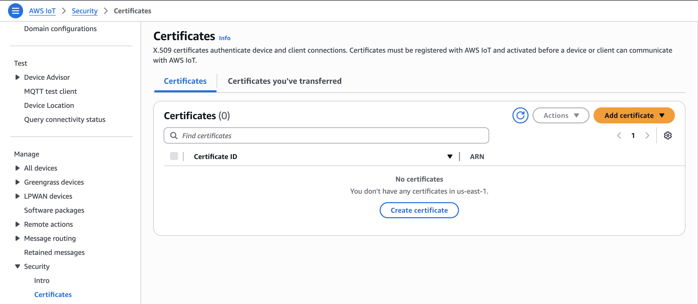

# IoT Helper

Example code for publishing MQTT messages to AWS IoT Core.

## Requirements

- Python 3.12+
- [AWS IoT Core certificates](https://docs.aws.amazon.com/iot/latest/developerguide/x509-client-certs.html)

## Setup

1. Install dependencies:
   ```bash
   pip install -r requirements.txt
   ```

2. Place your IoT certificates in the `certs/` folder:
   - `certificate.pem.crt` - Device certificate
   - `private.pem.key` - Private key
   - `AmazonRootCA1.pem` - Root CA

   You can download these files from the AWS IoT Console by adding a Certificate:

   

3. Update `main.py` with your values:
   - `IOT_ENDPOINT` - Your IoT endpoint (find in AWS IoT Console > Settings)
   - `TOPIC` - The MQTT topic to publish to
   - `CLIENT_ID` - Unique client identifier

## Run

```bash
python main.py
```
